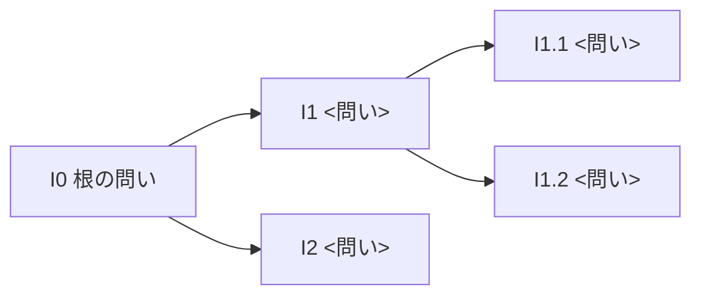

# イシューツリー

**調査**: <仮題> | **版**: 1 | **最終更新**: YYYY-MM-DD | **入力**: framing.md（案 <○>）、premises.md、scan/wide.md

## 根の問い（I0）

- **状況**: <読み手が知っていること。例: 当社は中堅企業向けの会計ソフトを売っている>
- **複雑化**: <なぜ今それが問題か。例: 小規模企業でクラウド会計が広がり、既存顧客の一部が流れている>
- **問い**: <疑問文。例: 従業員 20 人以下の企業向けに、クラウド会計の新製品を来期に出すべきか>
- **答えの形**: <例: 出す / 出さない / 提携で出す の推奨と、その確度>
- **つながる決定**: <D1>

## ツリーの図

## 節の一覧

分け方: <式 / 分類 / 過程 / 判断の条件>。<例: I0 は判断の条件（I1 市場は十分か、I2 勝てるか、I3 採算は合うか）で分けた>

| ID | 問い | 親 | 葉 | 答えの形 | つながる決定 | 既知 | 本質的な選択肢 | 深い仮説 | 答えを出せる | 優先度 | 仮説 |
|---|---|---|---|---|---|---|---|---|---|---|---|
| I1 | <例: 対象の市場は十分に大きく、伸びているか> | I0 | — | | D1 | | | | | | |
| I1.1 | <例: 対象の企業数は何社か> | I1 | ○ | <数値（社）> | D1 | 既知（S000-0201） | ◎/○/△ | | | 低 | — |
| I1.2 | <例: クラウド会計の利用率は年 5% 以上伸びているか> | I1 | ○ | <はい・いいえと伸び率> | D1 | 未 | ◎ | ○ | ○ | 高 | H1 |

## MECE の点検

| 親 | 重なり | 抜け | 扱い |
|---|---|---|---|
| I0 | <なし> | <例: 「法規制で出せない」可能性> | <例: RP3 で範囲外とした / I4 として足した> |

## 範囲外とした問い

- <問い>（理由。`backlog.md` BL-<NNN>）

## 変更の記録

| 日付 | 変更 | 理由（予備調査、主張のまとめの逆流など） |
|---|---|---|
