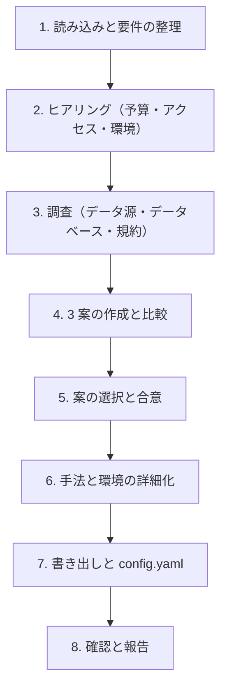

# researchkit-method スキル（R7: 問いと仮説 → 手法と分析環境）

イシューツリーの節と仮説に答えるための手法の組み合わせ、データ源、分析環境を決め、`docs/method.md` に書く。ここで決めたことは、憲章（R8 `researchkit-constitution`）、RQ の切り出し（R9 `researchkit-questions` の `**手法**`）、共通基盤（R10 `researchkit-foundation`）、品質基準（R11 `researchkit-deliverable`）、各 RQ の `plan.md`、`.researchkit/config.yaml` の `commands` の前提になる。

パスは `.researchkit/config.yaml` の `paths` で読み替える（以下は既定のパス）。

## 0. 大原則

- **推測で決めない。** 選定の根拠にしてよいのは、(a) `docs/concept/` と `docs/study/` に書かれた前提・問い・仮説、(b) ユーザーの回答、(c) 出典付きの調査結果（予備調査を含む）の 3 つだけ。
- **3 案を必ず比べる。** ユーザーが手法を決めていても、比較の基準として 3 案を示す（決めている手法を 1 案に含め、主となる手法の違う案や、手法を足した案を並べる）。
- **仮説を判定できる手法を選ぶ。** `hypotheses.md` の反証条件を、その手法で観測できるかを比較の観点に必ず入れる。観測できない仮説が残る案は、その仮説と理由を示す。
- **AI と回せる構成を重視する。** researchkit は、エージェントが検索、出典の確認、分析のスクリプトの実行、数値の突き合わせ（`numbers.py`）を自分で回して確かめる。人にしかできない作業（インタビューの実施、有料のデータの入手、社内データの取得）は `[人]` の作業として数え、比較の表に量を示す。
- **数値はスクリプトの出力に置く。** 分析は `studies/<NNN-name>/analysis/` のスクリプトから再実行でき、報告に使う数値は `analysis/out/*.json` に出す構成にする（steering の原則 8、「数値の参照」）。
- **事実は変わる。** データベースの収録範囲、API の条件、利用規約、料金には、出典 URL と参照日を付ける。出典のない事実は書かない。手法ごとの定石は [references/](./references/) にまとめてあるが、データベースやツールの条件は実行のたびに公式のページで確かめる。
- **書き出す前に合意を取る。** 自動モード（`--auto`。`researchkit-bootstrap` の自動モードと一括質問モードからはこのモードで呼ばれる）では、§6 の規則で決めて記録する。
- ドキュメントは日本語で書く。データベース名、ツール名、コマンドは原文のままでよい。

## 1. 引数と入出力

```text
$ARGUMENTS
```

引数は、追加の希望や制約として扱う（例: 「インタビューもしたい」「R で分析したい」）。`--auto` は位置を問わず、希望として扱う前に取り除く。

| 入力 | 用途 |
|---|---|
| `docs/concept/seed.md` | 読み手、決めたいこと（D1〜）、期限、答えの使い道 |
| `docs/concept/premises.md` | RP1（読み手）、RP3（範囲）、RP4（期限）、RP5（予算）、RP6（使えるデータとアクセス）、RP7（要求する確度）、RP9（倫理と個人情報）、RP12（既知の制約） |
| `docs/concept/framing.md` | 問いの立て方（仮説検証型／探索型／比較評価型など）。手法の向き不向きに効く |
| `docs/scan/wide.md` | 既存の調査・先行研究・データの所在の地図 |
| `docs/study/issue-tree.md`、`hypotheses.md` | 答えるべき節（I1〜）と仮説（H1〜）、反証条件 |
| `docs/study/pilot/` | 予備調査で分かったこと（データが手に入るか、検索で何件出るか、話を聞ける相手がいるか） |
| `.researchkit/memory/constitution.md` | すでにある場合は、その条項に従う |

| 出力 | 役割 |
|---|---|
| `docs/method.md` | 採用した手法の組み合わせ、節・仮説と手法の対応、データ源と情報源、分析環境、比較した案と却下した理由、見直しの条件、出典。様式は [templates/method.md](./templates/method.md) |
| `.researchkit/config.yaml` | `commands.analysis`、`commands.test`。必要なら `data.max_file_mb` |

終わったら、`researchkit-bootstrap` の記録の形で R7 を記録する（`docs(bootstrap): R7 手法と分析環境を選定`、trailer `Researchkit-Bootstrap: R7`）。単独で実行したときも記録する。見直しモードでは記録しない（`docs(method): <変更の要約>` の通常のコミットにする）。

`docs/method.md` がすでにある場合は、**見直しモード**として §4 に従う。既存の調査に取り込んだ場合（`--adopt`）は、既存の資料とスクリプトを読み、現状を記録する形で書く（§5）。

## 2. 手順



### ステップ 1: 読み込みと要件の整理

入力を読み、手法の選び方に効く要件を整理する。この段階では決めない。

- **問いの性質**: 節と仮説ごとに、答えの形（量か、質か、比較か、有無か）、必要な証拠の種類（統計、論文、企業の開示、当事者の声、データの分析結果）
- **要求する確度**（RP7）: 「確実」が要る決定か、「示唆」で足りる探索か
- **期限と予算**（RP4、RP5）: 有料のレポート、データベース、論文、謝礼、文字起こしの費用をかけられるか
- **使えるデータとアクセス**（RP6）: 公開データ、契約しているデータベース、社内データ、話を聞ける相手
- **倫理と個人情報**（RP9）: 人に話を聞くか、個人データを扱うか、倫理審査が要るか
- **予備調査の結果**: 手に入らなかったデータ、検索で件数が少なすぎた・多すぎた問い、話を聞けなかった相手

### ステップ 2: ヒアリング

AskUserQuestion で、次の項目のうち `docs/` で決まっていないものを聞く。1 ラウンド最大 4 問、推奨案を先頭に `(Recommended)` を付けて置く。

| ID | 項目 | 例 |
|---|---|---|
| M1 | 有料の情報源にかけられる費用 | なし（公開の情報だけ）/ レポート数本まで / 契約しているデータベースを使う |
| M2 | アクセスできるデータ | 公開データだけ / 社内データ（担当部署、申請の要否）/ 購入するデータ |
| M3 | 人に話を聞けるか | 聞けない / 社内の関係者 / 顧客・利用者 / 専門家。倫理審査の要否 |
| M4 | 分析の言語と環境 | Python（uv）/ R / 表計算ソフトだけ / 指定なし |
| M5 | 分析を担う人のスキル | 統計の知識、プログラミングの経験。AI が書いたスクリプトを読めるか |
| M6 | 有料の論文を入手できるか | 機関の購読がある / ない（オープンアクセスだけ）/ 1 本ずつ買う |
| M7 | 手法にかけられる時間 | 期限までの週数、人が割ける時間 |
| M8 | 既存の資産 | 過去の調査、データ、スクリプト、インタビューの記録 |

- 回答から新しい論点が出たら、次のラウンドで聞く。
- 回答は `docs/method.md` の「前提と制約」に、項目 ID を付けて記録する。

### ステップ 3: 調査

`docs/scan/wide.md` の「データの所在」を出発点に、WebSearch と WebFetch で、候補のデータ源とデータベースの収録範囲、更新の頻度、入手の方法（API、ダウンロード、申請）、利用規約とライセンス、料金を調べる。

- 手法ごとの「確かめること」（各 reference の末尾）を、公式のページで確かめる。
- 事実には出典 URL と参照日を付ける。
- 検索の前に `$RK budget --need <N>` で残りの回数を確かめてもよい。この工程の検索は少数に抑え、大きな調査は各 RQ の Q8 に回す。

### ステップ 4: 3 案の作成と比較

要件に合う 3 案を作る。系統の例は次のとおりである。前提と仮説から、比べる意味のある 3 つを選ぶ。

| 系統 | 主な手法 | 向いている場面 | 参照文書 |
|---|---|---|---|
| デスク中心 | 公的統計、企業の開示、業界レポート、報道、技術文書 | 市場・競合・技術の現状を、期限内に広く押さえる | [references/desk.md](./references/desk.md) |
| 文献中心 | 学術文献の系統的な検索と統合 | 効果や因果について、すでに研究がある | [references/literature.md](./references/literature.md) |
| データ中心 | 公開データや社内データの分析 | 量で答える問い。データが手に入る | [references/data.md](./references/data.md) |
| 定性中心 | インタビュー、アンケート | 理由、動機、使われ方。まだ言葉になっていない問い | [references/qualitative.md](./references/qualitative.md) |
| 混合 | 上の組み合わせ（例: デスク＋データ、文献＋インタビュー） | 量と理由の両方が要る。1 つの手法の弱点を別の手法で補う（三角測量） | 該当するもの |

各案について、次を比べる。

- 構成の概要（主な手法、補う手法、主な情報源、分析の方法）
- **答えられる範囲**: イシューツリーの節と仮説のうち、その案で答えられるもの、答えられないもの
- **期待できる確度**: 憲章の確度の段階（既定: 確実／可能性が高い／示唆／不明）でどこまで届くか。RP7 を満たすか
- 期限と費用（M1、M7）
- **人の作業の量**: `[人]` になる作業（インタビューの実施、データの入手、有料の論文の入手）
- **再現性**: 検索とスクリプトを再実行して同じ結果になるか
- Web 検索の量の見込み（`session.estimates` との比較）
- 主なリスク（データが手に入らない、話を聞ける相手が集まらない、文献が少ない）

### ステップ 5: 案の選択と合意

比較表と推奨案（理由付き）を示し、AskUserQuestion で選んでもらう。組み合わせを希望されたら、案を作り直して再提示する。合意するまで書き出さない。

### ステップ 6: 手法と環境の詳細化

選ばれた案について、次を決める。判断が分かれるものは質問する。手法ごとの定石は references を見る。

- **節・仮説と手法の対応**: イシューツリーの節（I1〜）と仮説（H1〜）ごとに、主な手法、補う手法、主な情報源。R9 で RQ を切り出すとき、`**手法**` の値はここから取る
- **データ源と情報源の一覧**: 名前、種類（統計、開示、データベース、データセット、人）、使う手法、入手の方法、費用、利用規約・ライセンス、見込みの等級（憲章の等級の既定）、`[人]` の要否
- **検索の道具**: 使う検索エンジンと学術データベース、API。文献レビューを含む場合は、検索ログに PRISMA 2020 の件数を残すことをここで決める
- **分析環境**: 言語、実行の方法、依存の管理、乱数のシード、図表の作り方
  - 既定は **Python と uv**。小さな調査は `uv run --with pandas --with matplotlib python {script}` のように依存をコマンドで渡す。再現性を重く見るなら、リポジトリのルートに `pyproject.toml` と `uv.lock` を置き、`uv run python {script}` にする（ロックで版を固定できる）
  - **R** を選ぶ場合は `Rscript {script}` とし、依存の版は renv（`renv.lock`）で固定する
  - 表計算ソフトだけで分析する場合は、数値の再計算ができないので、計算式と入力を表に残す（`{N:calc}`）。この場合も、報告の主要な数値は CSV と小さなスクリプトで再計算できる形を勧める
- **出力の形式**: 報告に使う数値は `studies/<NNN-name>/analysis/out/<名前>.json` に出す。キーはドット区切りで参照できる入れ子にする。割合は 0〜1 で持つ（`numbers.py` が 100 倍して `%` と比べる）。単位はキー名か、同じ JSON の `units` に書く。図は `analysis/out/fig/` に置く
- **スクリプトの置き方**: `studies/<NNN-name>/analysis/` に番号順（`01_clean.py`、`02_analyze.py`）で置き、プロジェクトのルートから実行できるよう、パスはスクリプトの場所を基準に解決する。生データは `data/raw/` から読み、加工しない
- **大きなデータ**: `data.max_file_mb` を超えるファイルは `data/large/` に置いてコミットせず、目録とハッシュだけを残す
- **定性調査の体制**（ある場合）: 対象者の集め方、倫理審査の要否、同意の取り方、謝礼、文字起こしの方法（外部のサービスに音声を送るかどうか）
- **テスト**（任意）: 前処理の関数や集計の検算を pytest か testthat で確かめるか

### ステップ 7: 書き出しと config.yaml

1. [templates/method.md](./templates/method.md) に沿って `docs/method.md` を書く。手法の組み合わせは mermaid で描く。
2. `.researchkit/config.yaml` を埋める。ファイルがなければ先に作る。

   ```bash
   $RK init --config-only
   ```

   続けて `commands.analysis` と `commands.test` を、ステップ 6 で決めたコマンドで手で書く。`commands.analysis` には `{script}` を必ず含める（`researchkit-analysis` がスクリプトのパスに置き換える）。まだ入っていないもの（`uv`、R、`pyproject.toml`）も、導入した後に使うコマンドを書き、`docs/method.md` の「分析のコマンド」に「000 で導入する」と注記する。テストを使わない場合、`commands.test` は空のままにする。
3. 大きなデータの扱いを変えた場合は、`data.max_file_mb` も直す。

### ステップ 8: 確認と報告

1. `$RK doctor` を実行する。`uv` や R をまだ入れていない環境では WARN が出るので、報告に含める（ERROR は直す）。
2. 次を日本語で報告する。
   - 採用した手法の組み合わせと、主な理由
   - 節・仮説と手法の対応の要約。採用した案で答えられない節・仮説（あれば）
   - データ源の要約と、`[人]` になる作業（有料の資料の入手、社内データの申請、インタビューの実施、倫理審査など）
   - 分析環境と、`config.yaml` に書いたコマンド
   - 見直しの条件
   - 次の手順の案内（R8 `researchkit-constitution`。`researchkit-bootstrap` の中で実行している場合は、その手順に戻る）

## 3. 記述の規則

- 各 RQ の検索式、標本、分析の詳細は書かない。それは各 RQ の `plan.md` で決める。ここに書くのは、調査全体が従う手法の組み合わせ、情報源、環境である。
- 却下した案も、理由と、どういう条件なら再検討するかとともに残す。
- 「見直しの条件」には、具体的な基準を書く（例: 社内データの申請が 4 週間で通らない、文献の検索で採用が 5 件未満、インタビューの対象者が 6 人集まらない）。
- データ源の利用規約は、要点（商用利用、再配布、引用の条件、スクレイピングの可否）を出典付きで書く。法的な判断はしない。迷うものは `[人]` の確認にする。

## 4. 見直しモード

`docs/method.md` がすでにある場合は、次の手順で見直す。

1. 既存の内容と、見直しのきっかけ（引数、予備調査や RQ の結果、見直しの条件に達したこと）を確かめる。
2. 変える部分と、その影響（既存の RQ の `**手法**` と `plan.md`、憲章、`docs/quality.md`、`config.yaml` の `commands`、分析のスクリプト）を示し、合意を取る。
3. 合意した変更だけを反映し、「変更履歴」に日付、内容、理由を足す。`config.yaml` も合わせて直す。

主な手法や分析の言語を変える見直しは、自動モードでは行わない（止まって報告する）。

## 5. 既存の調査への取り込み

`docs/method.md` がなく、既存の調査の資料（調査計画、分析のスクリプト、データ、インタビューの記録）がある場合は、選び直さずに現状を記録する。

1. 既存の計画書、README、スクリプト、データのフォルダを読む。元のファイルは動かさない・消さない。
2. ステップ 6 の項目ごとに、現状（ファイルの場所を添える）と、researchkit の原則（数値はスクリプトの出力に置く、生データを加工しない、目録とハッシュ、反証条件を先に書く）との差を書く。差は「見直しの候補」として節を分けて書き、すぐには直さない。
3. 3 案の比較の節には「取り込み時点の手法を記録した。比較はしていない」と書く。
4. 既存の分析の実行方法を `commands.analysis` に書く。`{script}` で呼べない形（ノートブックだけなど）なら、その差を「見直しの候補」に書く。

## 6. 自動モード（`--auto`）

| 論点 | 自動モードでの動作 |
|---|---|
| ヒアリング（M1〜M8） | 入力から推奨案を作って採用する。根拠がなければ、有料の情報源は使わない、公開データだけ、人には話を聞かない、Python と uv（`--with` で依存を渡す）を採る |
| 調査 | 省かない。Web を調べられない環境では「未確認」と書いて進め、見直しの優先度を「高」にする |
| 3 案からの選択、詳細 | 推奨案を採用する。比較表は残す。`[人]` の作業が少なく、仮説の反証条件を観測できる案を優先する |
| 定性調査を含めること | 含めてよいが、実施はすべて `[人]` にする。対象者や倫理審査の前提が premises にない場合は、含めない案を採り、含める案を見直しの候補に残す |
| 既存の手法・言語を変えること | しない。止まって報告する |

- 自動で決めたことは `docs/auto-decisions.md` に記録する（`researchkit-bootstrap` の書き方）。主な手法、有料の情報源の有無、定性調査の有無は、見直しの優先度を「高」にする。
- `docs/method.md` の「前提と制約」の該当する回答に `(auto: 仮定)` を付ける。

## 7. 禁止事項

- 出典のない事実（データベースの収録範囲、API の条件、利用規約、料金）を書くこと
- ユーザーの合意なしに `docs/method.md` を書き出す、または上書きすること（自動モードを除く）
- 3 案の比較を省くこと（取り込みを除く）
- 各 RQ の検索式や分析の詳細をここに書くこと
- 人の作業（インタビューの実施、有料の資料の入手、社内データの取得）を、AI ができるように書くこと
- 利用規約の解釈について、法的な判断を下すこと
