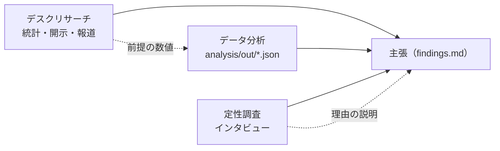

# 調査の手法と分析環境

**最終更新**: <YYYY-MM-DD> | **採用案**: <例: デスク中心＋データ分析（混合）>

この調査のすべての RQ が従う、手法の組み合わせ、情報源、分析環境。各 RQ の `plan.md` は、この文書と憲章（`.researchkit/memory/constitution.md`）、品質基準（`docs/quality.md`）に従う。手法ごとの進め方は `researchkit-method/references/` の参照文書（desk.md、literature.md、data.md、qualitative.md）に従う。変更するときは `researchkit-method` の見直しモードで行う。コマンドの正本は `.researchkit/config.yaml` の `commands` であり、この文書の「分析のコマンド」はその説明である。

## 1. 前提と制約

### 要件の要約

- **問いの性質**: <例: D1 は市場の規模（量）、D2 は利用者が乗り換える理由（質）>
- **要求する確度**（RP7）: <例: D1 の判断には「可能性が高い」以上が要る>
- **期限と予算**（RP4、RP5）: <例: 6 週間。有料レポートは 1 本まで>
- **使えるデータとアクセス**（RP6）: <例: 公開統計、社内の販売データ（申請が要る）>
- **倫理と個人情報**（RP9）: <例: 利用者へのインタビューあり。個人情報は匿名化する>
- **予備調査で分かったこと**: <例: 〇〇の統計は 2020 年で更新が止まっている（docs/study/pilot/results.md）>

### ヒアリングの回答

| ID | 項目 | 回答 |
|---|---|---|
| M1 | 有料の情報源にかけられる費用 | <回答> |
| M2 | アクセスできるデータ | <回答> |
| M3 | 人に話を聞けるか | <回答> |
| M4 | 分析の言語と環境 | <回答> |
| M5 | 分析を担う人のスキル | <回答> |
| M6 | 有料の論文を入手できるか | <回答> |
| M7 | 手法にかけられる時間 | <回答> |
| M8 | 既存の資産 | <回答> |

## 2. 採用した手法の組み合わせ



<組み合わせの説明。主となる手法、補う手法、手法どうしでどう確かめ合うか（三角測量）、なぜこの組み合わせにしたか。>

## 3. 節・仮説と手法の対応

R9（`researchkit-questions`）で RQ を切り出すとき、`**手法**` の値はこの表から取る。

| 節・仮説 | 問いの要約 | 主な手法 | 補う手法 | 主な情報源 | 答えられる確度の見込み |
|---|---|---|---|---|---|
| <I1.1 / H1> | <要約> | <desk> | <data> | <e-Stat の〇〇統計、各社の有価証券報告書> | <可能性が高い> |
| <I2 / H2> | <要約> | <qualitative> | <desk> | <利用者 8 人へのインタビュー> | <示唆> |

### 採用した案で答えられない節・仮説

- <なし / 節・仮説と理由、代わりの扱い（例: H4 は社内データが手に入らないので「不明」として残る。backlog に入れる）>

## 4. データ源と情報源

参照日: <YYYY-MM-DD>

| 名前 | 種類 | 使う手法 | 入手の方法 | 費用 | 利用規約・ライセンスの要点 | 見込みの等級 | [人] | 出典 |
|---|---|---|---|---|---|---|---|---|
| <例: e-Stat（政府統計の総合窓口）> | 統計 | desk、data | <ダウンロード / API（登録が要る）> | 無料 | <要点> | A | — | <URL> |
| <例: 社内の販売データ> | 社内データ | data | <担当部署への申請> | — | <社外秘。集計値だけを報告に出す> | A | 要（申請） | — |
| <例: 利用者へのインタビュー> | 人 | qualitative | <募集の方法> | <謝礼> | <同意書> | A（一次） | 要（実施） | — |

## 5. 検索の道具

| 用途 | 道具 | 備考 |
|---|---|---|
| 一般の Web 検索 | <WebSearch / WebFetch> | <予算は config.yaml の session> |
| 学術文献 | <例: Google Scholar、CiNii Research、J-STAGE、PubMed> | <採用した手法に文献レビューがある場合> |
| 統計・開示 | <例: e-Stat、EDINET> | <API の有無> |
| DOI の確認 | <https://doi.org/ と Crossref> | <check.py --online でも確かめる> |

- 文献レビューを含む場合: 検索ログに PRISMA 2020 の件数（特定、スクリーニング、適格性、採用）を残す。<含まない場合は削除する>

## 6. 分析環境

| 領域 | 採用 | 理由 |
|---|---|---|
| 言語 | <例: Python 3.12> | <理由> |
| 実行と依存の管理 | <例: uv。pyproject.toml と uv.lock をルートに置く / `--with` で渡す> | <理由> |
| 主なライブラリ | <例: pandas、matplotlib> | <理由> |
| 乱数のシード | <例: 各スクリプトの冒頭で固定し、値を出力の JSON に書く> | <再現のため> |
| 出力の形式 | `studies/<NNN>/analysis/out/<名前>.json`（割合は 0〜1、単位は `units`） | `numbers.py` が読む |
| 図表 | <例: `analysis/fig/` に PNG と、元の数値の CSV> | <理由> |
| テスト | <例: pytest で前処理と集計の検算 / 使わない> | <理由> |
| 大きなデータ | `data.max_file_mb` = <5> MB を超えるものは `data/large/`（コミットしない） | <理由> |

### ディレクトリ構成

```text
<例:
data/
├── manifest.md          # 目録（出所、取得日、ライセンス、SHA-256）
├── raw/                 # 小さな生データ（加工しない）
└── large/               # 大きな生データ（コミットしない）
studies/<NNN-name>/analysis/
├── 01_clean.py          # 前処理
├── 02_analyze.py        # 分析
├── out/                 # 報告に使う数値（JSON）
└── fig/                 # 図>
```

### 分析のコマンド

`.researchkit/config.yaml` の `commands` に書いたもの。

| 用途 | `commands` のキー | コマンド |
|---|---|---|
| 分析のスクリプトの実行 | `analysis` | <`{script}` を含むコマンド。例: `uv run --with pandas --with matplotlib python {script}`> |
| テスト（任意） | `test` | <例: `uv run --with pytest --with pandas pytest studies` / 空> |

<まだ導入していないものは「000 で導入する」と書く。>

## 7. 定性調査の体制

<定性調査を含まない場合は「対象外」と書く。>

- **対象者の集め方**: <例: 既存顧客から、利用の頻度で層を分けて募集する（[人]）>
- **倫理審査**: <要 / 不要と、その理由。所属機関の手続き>
- **同意の取り方**: <同意書の様式、録音の可否、データの保存期間>
- **謝礼**: <金額と支払いの方法>
- **文字起こし**: <手作業 / ツール。外部のサービスに音声を送るか、その同意>

## 8. 比較した案

| 観点 | <案 A> | <案 B> | <案 C> |
|---|---|---|---|
| 構成の概要 | <概要> | <概要> | <概要> |
| 答えられる範囲（節・仮説） | <評価> | <評価> | <評価> |
| 期待できる確度 | <評価> | <評価> | <評価> |
| 期限と費用 | <評価> | <評価> | <評価> |
| 人の作業の量 | <評価> | <評価> | <評価> |
| 再現性 | <評価> | <評価> | <評価> |
| Web 検索の量の見込み | <評価> | <評価> | <評価> |
| 主なリスク | <評価> | <評価> | <評価> |

### 却下した案と理由

- **<案>**: <却下した理由。どういう条件なら再検討するか>

## 9. 見直しの候補

<既存の調査に取り込んだときだけ書く。researchkit の原則との差と、直す案。なければ節ごと削除する>

## 10. 見直しの条件

次のいずれかに当てはまったら、`researchkit-method` の見直しモードで手法を見直す。

- <例: 社内データの申請が 4 週間で通らない>
- <例: 文献の検索で、採用が 5 件未満だった>
- <例: インタビューの対象者が 6 人集まらない>

## 11. 出典

- <データベースの収録範囲のページ>: <URL>（参照日 <YYYY-MM-DD>）

## 変更履歴

| 日付 | 変更内容 | 理由 |
|---|---|---|
| <YYYY-MM-DD> | 初版 | — |
