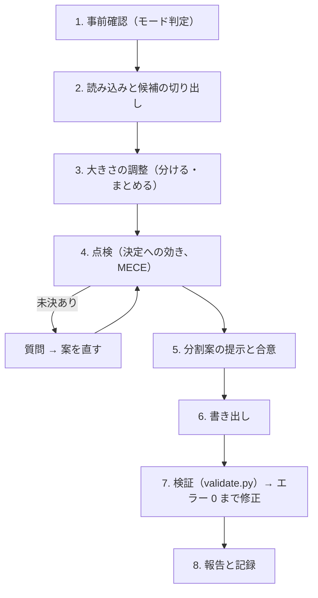

# researchkit-questions スキル（R9: イシューツリー → RQ への仕分け）

イシューツリーと仮説を読み、**1 つの worktree で、計画 → 収集 → 分析 → 主張のまとめ → レビューを通せて、答えが決定を動かす塊**に問いを仕分ける。出力は `researchkit-question` / `researchkit-all` の入力（`docs/questions/spec_order.md` と `docs/questions/NNN-<slug>.md`）になる。`gamekit-features` の調査版である。

パスは既定の配置で書いている。`.researchkit/config.yaml` の `paths` で読み替える。

## 0. 大原則

- **問いは意思決定から導く**（steering の基本原則 3）。すべての RQ を `docs/concept/seed.md` の決定（D1〜）につなぐ。**答えても決定が変わらない問いは RQ にしない**（§4.2）。面白い問いでも、決定に効かなければ `backlog.md` に送る。
- **推測で埋めない。** RQ の根拠にしてよいのは、(a) `docs/concept/`・`docs/study/`・`docs/method.md` の記述、(b) ユーザーの回答の 2 つだけ。足りないものは質問する。
- **大きさを揃える。** 1 件の RQ は 1 つの worktree・1 回の RQ の工程で答えられる大きさにする（§3.2）。大きすぎる RQ は収集の途中で予算が尽き、小さすぎる RQ は工程の手間（仕様・計画・2 回のレビュー）が中身を上回る。
- **000 と 999 は作らない。** 共通の出典台帳・用語集・データの目録・分析環境（`000-research-foundation`）は R10 の `researchkit-foundation` が、統合報告（`999-research-report`）は R11 の `researchkit-deliverable` が作る。ここで見つけた共通の要素（複数の RQ が使う統計、用語の定義、共通のデータ）は、RQ にせずに完了報告の「基盤の候補」に挙げる。
- **上流の文書は書き換えない。** `docs/concept/seed.md`、`premises.md`、`docs/study/issue-tree.md`、`docs/method.md` は読むだけにする。書き換えてよいのは、`docs/concept/backlog.md`（作成・追記）と、`docs/study/hypotheses.md` の一覧の「確かめる RQ」の列だけである。食い違いを見つけたら、該当するスキル（`researchkit-seed`、`researchkit-hypothesis`、`researchkit-method`）の更新モードを案内する。
- **分割の前に合意を取る。** RQ のファイルを書く前に分割案を示し、承認を得る。自動モード（`--auto`。`researchkit-bootstrap` の `--auto`・`--oneshot` からはこのモードで呼ばれる）では §7 の規則で決めて記録する。

## 1. 引数・モードと出力

```text
$ARGUMENTS
```

`--auto` と `--backlog [ID,…]` は位置を問わず、追加の希望として扱う前に取り除く。

| 条件 | モード | 手順 |
|---|---|---|
| `docs/questions/` がない、または `NNN-*.md` が 1 つもない | **新規モード** | §2 |
| `docs/questions/` に researchkit の様式の RQ ファイルがあり、`--backlog` なし | **再実行モード** | §2 を §5 の規則で行う |
| 同上で `--backlog` あり | **バックログモード** | §6 |
| `docs/questions/` や既存の資料に researchkit の様式でない問いの一覧がある（調査計画書、目次案、番号のないファイル） | **取り込みモード** | §8 |

| 出力 | 役割 |
|---|---|
| `docs/questions/NNN-<slug>.md` | 1 RQ 1 ファイルの概要。様式は [templates/question.md](./templates/question.md)。見出しとヘッダ行は `validate.py` と `researchkit-worktree` が読むので、変えない |
| `docs/questions/README.md` | RQ の一覧、運用ルール、葉・仮説と RQ の対応（MECE の記録）。様式は [templates/readme.md](./templates/readme.md) |
| `docs/questions/spec_order.md` | 着手順と段階分け。様式は [templates/spec_order.md](./templates/spec_order.md) |
| `docs/concept/backlog.md`（作成・追記） | RQ にしなかった候補（候補 / 却下）と RQ 化済みの記録。`researchkit-sparring` が作ったものがあればそれに足す。なければ [templates/backlog.md](./templates/backlog.md) で作る |
| `docs/study/hypotheses.md`（一覧の「確かめる RQ」の列だけ） | 仮説ごとに、確かめる RQ（`NNN-slug`） |

終わったら、`researchkit-bootstrap` の形で R9 を記録する（`git commit --allow-empty -m "docs(bootstrap): R9 問いに仕分け" -m "Researchkit-Bootstrap: R9"`。成果物のコミットに trailer を付けてもよい）。単独で実行したときも記録する。バックログモードでは記録しない（`docs(questions): BL-NNN を RQ にする` などの通常のコミットにする）。

## 2. 手順



### ステップ 1: 事前確認

- §1 の表でモードを判定する。バックログモードなら §6、取り込みモードなら §8 に進む。
- 規約ファイル（`CLAUDE.md`、`AGENTS.md`、`.kiro/steering/*`、`.researchkit/memory/constitution.md`）を読み、従う。
- 前提の成果物（`docs/concept/seed.md`、`docs/study/issue-tree.md`、`docs/study/hypotheses.md`、`docs/method.md`）がなければ、欠けている工程（R1、R5、R7）を案内して止まる。憲章（R8）がなくても仕分けはできるが、完了報告に書く。

### ステップ 2: 読み込みと候補の切り出し

| 入力 | 主に使うところ |
|---|---|
| `docs/concept/seed.md` | 決定（D）、決め方の規則、境目の見当、外れたときの損失（§4.2 の点検に使う） |
| `docs/concept/premises.md` | 範囲（地域・期間・対象）、期限、予算、使えるデータ、要求する確度、倫理（RP1〜RP12） |
| `docs/study/issue-tree.md` | 葉の問い、答えの形、つながる決定、既知かどうか、優先度、MECE の点検 |
| `docs/study/hypotheses.md` | 仮説、反証条件、検証に要る証拠、答えられるか（R6 の判定） |
| `docs/study/pilot/` | 予備調査で、データが手に入るか、問いが答えられるかを確かめた結果 |
| `docs/method.md` | 節・仮説と手法の対応（`**手法**` の値はこの表から取る）、主な情報源、`[人]` になる入手 |
| `docs/scan/wide.md` | すでに分かっていること（調べ直さない）、データの所在 |
| `docs/concept/backlog.md` | 既存の候補（仕分けの根拠にはしない） |

候補は **葉から切り出す**。

1. `issue-tree.md` の葉を、優先度の高い順に並べる。
2. 葉ごとに扱いを決める。
   - **既知**（`wide.md` で答えが出ている）: RQ にしない。README の対応表に「既知（出典 ID）」と書く。
   - **答えられない**（`hypotheses.md` の「答えられるか（R6）」が `答えられない`）: RQ にしない。backlog に、答えられない理由と、答えられるようになる条件を書く。
   - **保留**（R6 で `保留`）: RQ にしてよいが、「範囲」と「人の作業の見込み」に、保留の理由と、先に解くべきこと（データの入手など）を書く。
   - **優先度が低い**: 原則として backlog に送る。ほかの RQ に同じ情報源で入れられるなら、その RQ の範囲に含める。
   - それ以外: RQ の候補にする。
3. 候補ごとに、つながる決定（D）、つながる仮説（H）、手法（`docs/method.md` の対応表）、想定する情報源、出典の見込みの件数を書き出す。

### ステップ 3: 大きさの調整

§3 の規則で、候補を分けたりまとめたりして、大きさを揃える。

### ステップ 4: 点検

§4 の 2 つの点検（決定への効き、MECE）を行う。決められないことがあれば、AskUserQuestion で質問する。

- 1 ラウンド最大 4 問。各問に選択肢を 2〜4 個付け、推奨案を先頭に `(Recommended)` 付きで置く。
- 主な論点: 決定への効きが疑わしい候補を残すか、まとめるか分けるかの境目にある候補、着手順の先頭、期限や予算に入らない候補を backlog に送るか。
- 決定（D）そのものを変える必要が出たら（例: 決定が曖昧で、答えの使い道が決まらない）、ここでは決めずに `researchkit-seed` の更新モードを案内する。

### ステップ 5: 分割案の提示と合意

分割案をまとめて示す。

1. **RQ の一覧表**: `# | ファイル名（NNN-slug） | 問い | 区分 | 依存 | 手法 | つながる決定 | つながる仮説 | 出典の見込み`
2. **葉・仮説と RQ の対応**: 葉ごとの扱い（RQ / 既知 / backlog / 範囲外）と理由
3. **決定への効き**: RQ ごとに「答えが A なら D1 は X、B なら Y」の 1 行
4. **基盤の候補**: 000 に回す共通の要素（複数の RQ が使う統計・用語・データ）
5. **backlog に送る候補と却下**

AskUserQuestion で「この案で書き出す / 修正する」を確かめ、合意するまで書き出さない。

### ステップ 6: 書き出し

テンプレートに沿って、`NNN-<slug>.md` 群、`README.md`、`spec_order.md`、`docs/concept/backlog.md`、`hypotheses.md` の「確かめる RQ」の列を書く。

- ヘッダ行は `**状態**: 未着手 | **区分**: <中核 / 補助> | **想定順序**: <N> | **依存**: <NNN-slug, … または —> | **手法**: <desk, literature, data, qualitative のうち使うもの>` の形を守る。`researchkit-worktree` と `validate.py` がこの行を読む。
- `spec_order.md` の各 RQ の行は **`- **N. [問い](./NNN-slug.md)**: 一言` の形を厳守する**。`researchkit-worktree` の `worktree_helper.py` がこの行を読み、ファイル名をそのまま `studies/NNN-slug` とブランチ `rq/NNN-slug` に使う。
- `N`、ファイル名の `NNN`、各 RQ ファイルの `**想定順序**` の 3 つを一致させる。
- README の一覧と `spec_order.md` には 000 と 999 の行を書かない（ファイルがまだないので検証でエラーになる）。R10・R11 が足す。
- 「つながる決定」には、答えで決定がどう変わるかを 1 行で書く（ID だけにしない）。
- 「答えの形」は、`seed.md` の決め方の規則と比べられる形にする（境目が「年 100 億円」なら、規模を億円で、範囲つきで出す）。
- `backlog.md` の既存の候補は残し、新しい候補を次の BL 番号から足す。「RQ にしなかった理由」を必ず書く。

### ステップ 7: 検証

```bash
python3 <skills>/researchkit-questions/scripts/validate.py docs/questions
python3 <skills>/researchkit-questions/scripts/validate.py docs/questions --graph
```

`<skills>` は、このスキルが置かれた skills ディレクトリである。`python3` がない環境では `python` または `py -3` に読み替える。`paths` を変えたプロジェクトでは、`--seed-file`、`--hypotheses-file`、`--backlog-file` で場所を渡す。

- エラーが 0 件になるまで直す。警告は内容を確かめ、意図どおりなら報告に書く。R9 の時点では「000・999 の RQ ファイルがない」の警告が出るのが正しい（R10・R11 が作る）。
- 「つながる RQ がない」決定・仮説の警告は、抜けの候補である。§4.3 で扱いを決め、README の対応表に理由を書く。
- `--graph` は、`spec_order.md` にそのまま貼れる被参照数の表と段階ごとの RQ の行を出す。段階の見出しの性格と mermaid 図は手で付ける。
- `README.md` と `spec_order.md` には実行コマンドだけを書く（スクリプト本体は埋め込まない）。

`validate.py` が検証すること: ファイル名と番号の重複、ヘッダ行の値（状態は `未着手`／`設計済み`／`完了`／`人の作業待ち`、区分は `基盤`／`中核`／`補助`／`統合`、手法は `desk`／`literature`／`data`／`qualitative`）、必須の節、依存の循環と存在しない参照、000 と 999 の規則、決定 D と仮説 H が `seed.md`・`hypotheses.md` にあるか、どの決定にもつながらない RQ（エラー）、README と `spec_order.md` との整合、被参照数の表。R12 の全体の検証では `--require-reserved` を付けると、000 と 999 がないことをエラーにできる。

### ステップ 8: 報告と記録

- 作成・更新したファイル
- RQ の数（中核 / 補助）と、着手順の先頭 3 件
- 葉の扱い（RQ / 既知 / backlog / 範囲外）の件数と、決定ごとの RQ の数
- 決定への効きの点検で外した候補と理由
- 基盤の候補（000 に回すもの）
- backlog の件数（候補 / 却下）
- 検証の結果（エラー、警告）
- 未決のまま残した項目
- 次の手順の案内（R10 `researchkit-foundation`。`researchkit-bootstrap` の中で実行している場合は、その手順に戻る）

最後に §1 の形で R9 を記録する。

## 3. 仕分けの規則

### 3.1 仕分けの単位

- **1 件の RQ は、イシューツリーの葉 1〜3 本を受け持つ。** 同じ親の葉で、同じ情報源と手法で答えられるものはまとめてよい。違う第 1 層（I1 と I2）にまたがる RQ は作らない。
- **1 件の RQ が確かめる仮説は 1〜3 個**にする。1 つの仮説を 2 つの RQ に分けない（反証条件の判定が割れる）。仮説が大きすぎて 1 つの RQ に入らないなら、`researchkit-hypothesis` の更新モードで仮説を分けるよう案内する。
- **答えの形は 1 つにする。** 「規模（数値）」と「理由（要因の一覧）」のように形の違う答えを 1 つの RQ に入れない。
- **人の作業を切り離す。** `[人]` の作業（インタビューの実施、有料レポートの購入、社内データの取得）が要る部分と、AI だけで進められる部分は、可能なら別の RQ にする。人の作業を待つ間も、ほかの RQ を `完了` まで進められる。

### 3.2 大きさの目安

1 件の RQ は、1 つの worktree・1 回の RQ の工程（Q1〜Q13）で答えられる大きさにする。

| 目安 | 値 | 根拠 |
|---|---|---|
| 出典の見込み | 10〜40 件 | 10 件未満では、反対の証拠を探す余地がなく確度が上がらない。40 件を超えると、抜き書きと 2 回のレビューが 1 回の工程に収まらない |
| 手法 | 1〜2 つ | 3 つ以上は計画（`plan.md`）が手法ごとに分かれ、事実上複数の RQ になる |
| つながる決定 | 1〜2 個 | 3 個以上の決定に効く問いは、問いが大きすぎるか、抽象的すぎる |
| Web 検索 | `session.estimates.rq`（既定 100 件）以内 | 1 件の RQ を 1 セッションの予算で終えられるようにする（steering「セッションの区切り」） |

文献レビューの RQ は出典が多くなりやすい。包含基準を満たす文献が 40 件を大きく超える見込みなら、対象の期間・地域・研究の種類で分ける。

### 3.3 分けすぎ・まとめすぎの見分け方

| 兆候 | 判断 | 直し方 |
|---|---|---|
| 出典の見込みが 10 件未満、数回の検索で答えが出る | 分けすぎ | 同じ情報源を使う RQ の範囲に入れる。単独の事実の確認なら、RQ にせずに 000 の共通の出典か、その事実を使う RQ の中で調べる |
| いつも別の RQ と同じ出典・同じ手法で集める | 分けすぎ | まとめる |
| 単独では決定が変わらず、別の RQ の答えと組み合わせて初めて効く | 分けすぎ | 組み合わせる相手の RQ にまとめる |
| 出典の見込みが 40 件を超える、検索の見積もりが予算を超える | まとめすぎ | 葉ごと、期間・地域・対象ごとに分ける |
| 手法が 3 つ以上、答えの形が 2 つ以上 | まとめすぎ | 手法ごと、答えの形ごとに分ける |
| つながる決定が 3 つ以上、仮説が 4 つ以上 | まとめすぎ | 決定・仮説ごとに分ける |
| 違う第 1 層の葉にまたがる | まとめすぎ | 第 1 層ごとに分ける |
| `[人]` を待つ部分と AI だけで進む部分が混ざる | まとめすぎ | 人の作業の部分を別の RQ にする |

### 3.4 区分

| 区分 | 意味 |
|---|---|
| **中核** | 答えが決定（D）を直接動かす RQ。`seed.md` の決め方の規則の「調べる対象」に当たる |
| **補助** | 中核の RQ の前提を埋める RQ（定義の確定、母集団の大きさ、比較の基準）。答えは中核の RQ を通して決定に効く |
| `基盤`・`統合` | 000・999 だけが使う。このスキルでは使わない |

補助の RQ も、どの決定に（どの中核の RQ を通して）効くかを「つながる決定」に書く。

### 3.5 依存

- `**依存**` には、その RQ の仕様・計画を立てるのに**先に答えが要る** RQ の完全名（`NNN-slug`）をカンマ区切りで書く。なければ `—`。同じ情報源を使うだけなら依存ではない。
- R9 の時点では 000 はまだないので、000 への依存は書かない（R10 が足す）。999 にはどの RQ も依存しない。
- 循環依存は作らない。

### 3.6 ファイル名・番号・名称

- ファイル名は **`NNN-<slug>.md`**（例: `001-market-size.md`）。`NNN` は 3 桁ゼロ埋めの想定順序で、`studies/NNN-slug` とブランチ `rq/NNN-slug` にそのまま対応する。
- **`000` と `999` は予約番号で、このスキルでは使わない**（§0）。すでに `000-*`・`999-*` があれば、名前を問わずそれを共通基盤・統合報告として扱い、書き換えない。
- slug は英小文字のケバブケース、2〜4 語、問いの対象を表す名詞句（例: `market-size`、`competitor-pricing`、`user-needs`）。
- **番号は初回に着手順で振り、以後は固定する。** 後から足す RQ は既存の最大値の次から振る。着手順は `spec_order.md` の並びで表す。
- 名称（H1）は日本語の疑問文にし、README の一覧のリンク文言と一致させる。

### 3.7 着手順

1. 依存の段階の順（`--graph` の段階）。
2. 同じ段階の中では、決定への効きが大きいもの（今の見込みが境目に近く、外れたときの損失が大きいもの）を先にする。
3. 次に、ほかの RQ の前提になるもの（被参照数の多いもの）と、`[人]` の作業に時間がかかるもの（早く頼んでおく）を先にする。

## 4. 点検

### 4.1 記述の粒度

- **書く**: 問い、つながる決定と効き方、つながる仮説、答えの形、範囲（含む・含まない）、想定する情報源と出典の見込み、人の作業の見込み。
- **書かない**: 検索式、データベースごとの手順、標本の大きさ、分析の手法の細部、判定の閾値の細部。これらは RQ の工程の Q2（`spec.md`）と Q5（`plan.md`）で決める。

### 4.2 決定への効き（答えても決定が変わらない RQ を除く）

候補ごとに、次を 1 行で書けるかを確かめる。

> 答えが「A」なら D<n> は「X」、答えが「B」なら「Y」。

- **書けない**（どの答えでも決定が同じ）なら、RQ にしない。backlog に「答えても D<n> の判断が変わらない」と書いて送る。
- **今の見込みが境目から遠い**（`seed.md` の「境目の見当」と「今の見込み」）、**外れたときの損失が小さい**、**答えが出る前に決定の期限が来る** 候補は、調べる価値が小さい。情報の価値（value of information。R. A. Howard "Information Value Theory", 1966）の考え方で、決定を変える見込みと、変わったときの得の大きさを比べる。削るかどうかはユーザーに確かめる（自動モードでは残し、優先度を下げて着手順の後ろに置く）。
- 補助の RQ は、効く先の中核の RQ を通して同じ点検をする。中核の RQ が削られたら、その補助の RQ も見直す。

安宅和人『イシューからはじめよ』（英治出版、2010）の「良いイシュー」の 3 条件（本質的な選択肢である、深い仮説がある、答えを出せる）のうち、ここで見るのは「本質的な選択肢である」と「答えを出せる」である。「深い仮説がある」は R5 の `researchkit-hypothesis` が見ている。

### 4.3 MECE（抜けと重なり）

MECE（Mutually Exclusive, Collectively Exhaustive。Barbara Minto『The Pyramid Principle』で広まった考え方）で、RQ の一覧を点検する。結果は README の「葉・仮説と RQ の対応」に残す。

| 点検 | 見ること | 見つかったら |
|---|---|---|
| **抜け（決定）** | すべての決定（D）に、少なくとも 1 件の中核の RQ がつながっているか | RQ を足す。調べないと決めたなら、その旨と理由を報告し、`researchkit-seed` の更新モードで決定を外すかを確かめる |
| **抜け（仮説）** | すべての仮説（H）を、どれかの RQ が確かめるか | RQ を足すか、既存の RQ に入れる。確かめないなら backlog に理由を書く |
| **抜け（葉）** | 優先度が高・中の葉が、どれかの RQ か「既知」に当たるか | RQ を足すか、扱いと理由を対応表に書く |
| **重なり** | 2 つの RQ が同じ葉・同じ仮説を受け持っていないか。同じ出典群を同じ目的で集めていないか | 境目を「範囲」の含む・含まないで書き分ける。書き分けられないならまとめる |
| **粒度の揃い** | 同じ段階の RQ の大きさが大きく違わないか | §3.3 で分ける・まとめる |

`validate.py` は、どの RQ にもつながらない決定と仮説を警告する。ツリーそのものの抜けと重なり（葉の切り方）は R5 の点検の範囲であり、ここで見つけたら `researchkit-hypothesis` の更新モードを案内する。

## 5. 再実行モード

- 既存の RQ ファイル、README、`spec_order.md` を読み、上流（`seed.md`、`issue-tree.md`、`hypotheses.md`、`method.md`）の変更点を洗い出す。RQ の工程からの逆流（主張のまとめで仮説が崩れた、など）で呼ばれたときは、その理由を受け取る。
- 既存の RQ に対する **追加・分割・統合・取り下げ・依存や着手順の変更** の差分案を表で示し、承認されたものだけ反映する。
- `**状態**` が `設計済み` 以降の RQ ファイルは変更しない（正本は `studies/NNN-slug/`）。分割や統合が要りそうでも、提案にとどめて報告する。取り下げる RQ は、ファイルを消さずに backlog に「却下」として理由を書き、README から外すかをユーザーに確かめる。
- **既存の番号は振り直さない。**

## 6. バックログモード（`--backlog`）

`docs/concept/backlog.md` の候補を、既存の `docs/questions/` に RQ として足す。調査の途中で新しい問いが出たとき（steering の「エージェントの行動規範」）にも使う。

1. **対象の選択**: 引数の ID を使う。省略時は状態が「候補」のものを一覧し、AskUserQuestion（複数選択）で選んでもらう。「却下」「RQ化済み」の ID が指定されたら、進めてよいかを先に確かめる。
2. **決定への効きの確認**: §4.2 の点検をする。決定に効かない候補は、RQ にしない理由を示して止まる。新しい決定が要る場合は `researchkit-seed` の更新モードを、新しい仮説が要る場合は `researchkit-hypothesis` の更新モードを先に案内する。
3. **差分案の提示と合意**: 追加する RQ（番号は既存の最大値の次から）、大きさ（§3.2）、既存の `未着手` の RQ への影響、`spec_order.md` の並びの変更を示す。999 が `未着手` でなければ、統合報告を作り直す必要があることを伝える。
4. **書き出し**: RQ ファイル、README、`spec_order.md`、`hypotheses.md` の「確かめる RQ」を更新し、候補の状態を `RQ化済み（docs/questions/NNN-slug.md）` にする。
5. **検証と報告**: §2 ステップ 7・8 と同じ（R9 の記録はしない）。

## 7. 自動モード（`--auto`）

| 論点 | 自動モードでの動作 |
|---|---|
| 質問（§2 ステップ 4） | `seed.md`・`issue-tree.md`・`hypotheses.md`・`method.md` から推奨案を作って採用する |
| 分割案の合意 | 提示せずに書き出す。着手順は §3.7 の規則で決める。分割案は完了報告に載せる |
| 決定への効きが疑わしい候補 | どの答えでも決定が同じものだけ backlog に送る。調べる価値が小さいだけのものは残し、着手順の後ろに置く |
| 上流の文書を変える必要 | 変えない。完了報告に、見直しの優先度「高」として書く |
| 検証のエラー | 直す。同じ原因で 3 回直しても 0 件にならなければ止まる |

自動で決めたことは `docs/auto-decisions.md` に記録する（`researchkit-bootstrap` の書き方）。RQ の数と、backlog に送った候補は、見直しの優先度を「高」にする。

## 8. 取り込みモード（既存の調査）

`--adopt` で取り込んだ調査では、問いの一覧が別の形（調査計画書の問いの表、報告書の目次案、番号のないメモ）で残っていることが多い。元のファイルは動かさない・消さない。

1. まず現状を診断する。

   ```bash
   python3 <skills>/researchkit-questions/scripts/validate.py docs/questions --lenient
   ```

   `--lenient` はエラーを警告に落とし、番号のないファイル（`NNN-<slug>.md` でないもの）を検証の対象から外す。
2. 資料を 3 つに分けて、ユーザーに示す。
   - **そのまま使えるもの**: `NNN-<slug>.md` の形の RQ ファイル。状態が `設計済み` 以降のものは書き換えない。`未着手` のものに、足りない節（「つながる決定」「つながる仮説」など）を足す案を示す。
   - **予約番号のもの**: `000-*` と `999-*`。名前を問わず共通基盤・統合報告として扱い、`researchkit-foundation`・`researchkit-deliverable` の更新モードに回す。
   - **番号のない資料**: 問いの候補として読み、既存の問いの切り方と順番を尊重して、新しい RQ ファイル（既存の最大の番号の次から）にするか、backlog の候補にするかを差分案として示す。元の資料は README の「メタ文書（RQ ファイルではない）」の表に載せる（`validate.py` は、この表に載せたファイルを RQ ファイルとして検証しない）。
3. 合意した分だけ書き出し、`--lenient` なしの検証のエラーを、新しく書いたファイルについて 0 件にする。既存のファイルを書き換えないと直せないエラーは、一覧と直し方の案を報告に挙げる（自動モードでは直さずに止まる）。
4. `spec_order.md` がすでにあれば、その並びを保ち、新しい RQ を適切な段階に足す。

## 9. 禁止事項

- どの決定にもつながらない RQ を作ること（000 と 999 を除く）
- 000 と 999 の RQ ファイルを作ること（R10・R11 が作る）
- `docs/concept/` のファイルを、`backlog.md` の作成・追記以外で書き換えること。`docs/study/hypotheses.md` を、一覧の「確かめる RQ」の列以外で書き換えること
- `backlog.md` の既存の候補を消すこと（状態を変えるだけにする）
- ユーザーの合意なしに RQ ファイルを書き出す、または既存のファイルを上書きすること（自動モードを除く）
- `設計済み` 以降の RQ ファイルを書き換えること
- 既存の RQ の番号を振り直すこと、取り込んだ元の資料を動かす・消すこと
- 検証スクリプトの本体を出力ファイルに埋め込むこと
