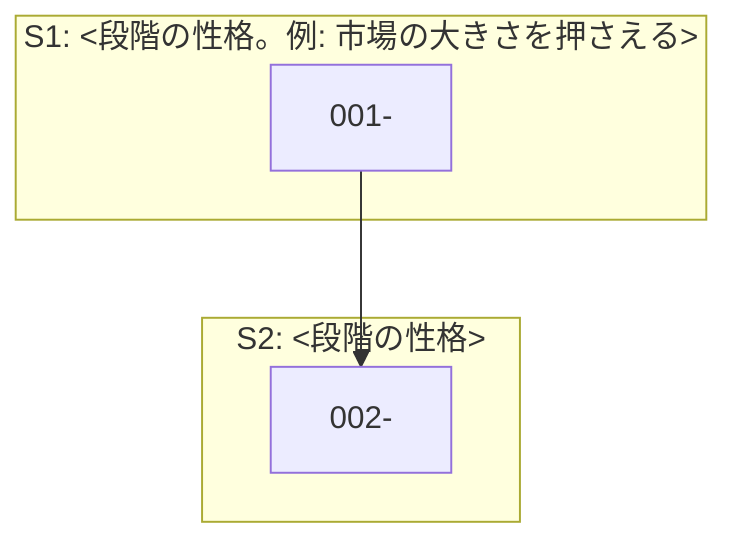

# RQ の着手順

`docs/questions/` の全 RQ を、**依存関係と決定への効き方で並べた、着手の順序の目安**。

> **このファイルは進捗を持たない。** 進捗は各 RQ ファイルの状態欄と `studies/<NNN-slug>/tasks.md` が正本。
> 各行の番号 `N` とファイル名の `NNN` は想定順序（採番）で、`researchkit-worktree` が `studies/NNN-<slug>` とブランチ `rq/NNN-<slug>` の番号として使う。**振り直さない。**

## この順序の作り方

各 RQ ファイルの `**依存**` を読み、依存の段階の順に並べた。同じ段階の中では、決定への効きが大きいもの（答えによって決定が変わる見込みが大きいもの）と、ほかの RQ の前提になるものを先に置く。`000`（共通基盤）は先頭に、`999`（統合報告）は末尾に置く。
被参照数と段階分けは次のコマンドで再現できる。

```bash
python3 <validate.py のパス> docs/questions --graph
```

### 被参照数の多い順（律速の RQ）

| 被参照 | RQ | 意味 |
|---|---|---|
| <n> | `<NNN-slug>` | <なぜ多くの RQ の前提になるか> |

## 段階分け



### 基盤

<!-- R10（researchkit-foundation）が 000-research-foundation の行をここに足す。R9 では見出しだけを置く -->

### S1: <段階の性格>

- **1. [<RQ の問い>](./001-<slug>.md)**: <一言>

### S2: <段階の性格>

- **2. [<RQ の問い>](./002-<slug>.md)**: <一言>

### 統合

<!-- R11（researchkit-deliverable）が 999-research-report の行をここに足す。R9 では見出しだけを置く -->
